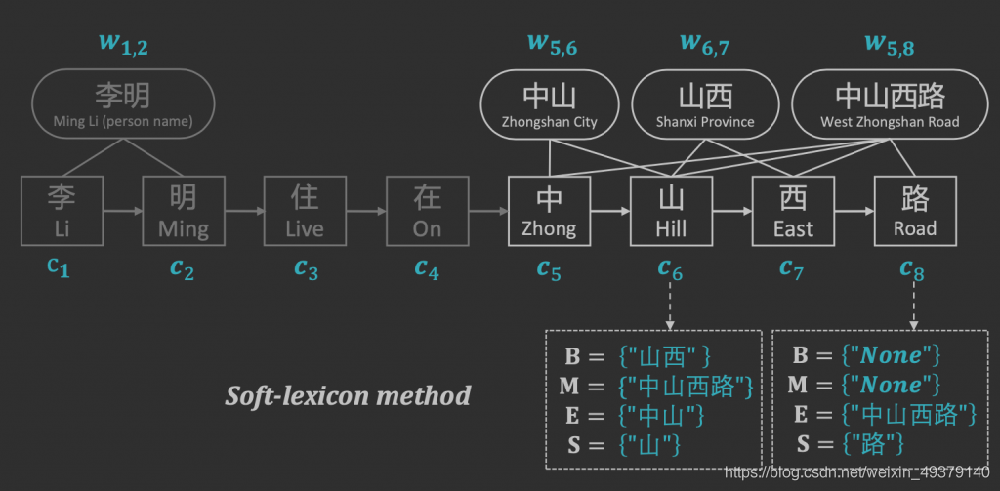

@[TOC](中文NER1 之 simplify the usage of Lexicon in Chinese NER)

# ACL-simplify the usage of Lexicon in Chinese NER
近期有个项目跟提取地址实体有关，所以系统性的把ner相关研究重新review了一遍，顺便记录下笔，方便以后查询。
这篇论文下载https://arxiv.org/abs/1908.05969    

这篇论文的启发是，利用**Lexicon**词汇信息去提升NER准去率，并且**Lattice-LSTM**(2018)取得了好的结果。 该模型在中文NER benchmark表现好，但是计算效率比较低。所以楼你我目的就是对比这个模型，要求速度更快。

首先，合并词汇信息到向量表示中。这种办法，可以避免引入复杂的序列结构来表征词汇信息。它只稍微改变字符表征层即可。实验在四个中文banchmark中文NER上表现很好。

## 中文NER难的问题
NER是识别person  location product  orgnization的，在英文中这些特殊名词都是自然的分割，比如大写。因为是标注每个字符，所以这是序列标注问题。

中文的NER任务更难，因为没有英文那种先天特殊词分割书写的优势/所以一种通用的时间方法是先分词，再把词引入到序列标注任务。与此同时，分词引入的错误也会导致下游序列标注任务的错误。
比如：南京市/长江大桥。
分词成：南京/市长/江大桥
这就导致NER很难把识别南京市为location实体，与长江大桥为location实体。与之相反，很可能为南京为location，江大桥为person。

上面这种问题，就导致很多中文ner在实际中的场景是使用字级别。2015和2018都有这样的尝试，最开始是把所有的分词情况都加入到模型，让模型去判断选那种分词。这种模型是2015年的基于LSTM-CRF的模型。结果证明Lattice-LSTM表现很好。缺点有：1.慢，2.这种结构很难转移到其他模型比如CNN或者Transformer上去。

这篇文章提出了
1. 一种加速方法
2. 还有一种编码lexicon词汇的方法

## 通用的NER结构
第一层，输入层（如 **char+bichar** 2018）
第二层，是序列模型层，它的作用是获取字符之前的依赖关系（如**CNN / LSTM / Trnasformer**）
第三层，是推理层 (如 **CRF** 2001)

## 中文NER的Lattice-LSTM 
目标是合并字符与词汇作为输入
首先，利用lexicon matching在输入文本上。这将增加一个从字符ci 到 字符cj的有向边（i < j） 。ci为输入字符串中的字符。它可以让一个字符连接了多个字符（因为有多种分词）。这种方式过后，就把模型的输入，由句子序列变成了图。它需要修改LSTM结构，对应修改输入、 h state、c memorryCell,。在更新阶段，输入包含，当前的字，上一层的h state和上一层的c ，还有对应的词。并且h和c都是数组。

这种设计中的不足：
1. 在memory更新阶段需要额外的去增加s、 h、 c   
2. 设计的函数很难并行计算

## 本论文的方法
论文的要解决额u的问题是目标要实现：
1. 模型能够保留所有字可能的词
2. 模型能够使用预训练词embedding

受**Softword technique**启发，用它来构建分词，并且允许一个字符有多个标签。
比如句子s={c1,c2,c3,c4,c5},  其中{c1,c2,c3,c4}和{c3,c4}是词，然后句子的输
出表示为segs(s) = {{B},{M},{B,M},{E},{O}}-----BMESO标签。

*这里segs(s)1={B}表示至少一个有一个以c1开头的词*
*segs{s}3={B,M}表示至少有一个 以字符s3开头的词 或者 以字符s3出现在词中间的词*

每个字符有一个5维度的类别表示{B,M,E,S,O}。论文的方法称作**ExSoftword**。
通过分析，ExSoftword有两个缺点。
1. 它不能支持预训练的word embeddings。
2. 尽管它能够包催所有可能的词，但是仍然丢失了一些信息。

句子 s =  {c1,c2,c3,c4} 中   {c1,c2,c3} 与  {c2,c3,c4}是词
sges(s)={ {B}, {B,M}, {M,E}, {E} }
这种形式不能就说明S就包含 {c1,c2,c3} 与  {c2,c3,c4}是词，因为同样也可以解释成是词{c1,c2,c3,c4} 与词{c2,c3}, 导致无法恢复原始的分词。

**改进版本**
解决这个问题，论文中提出要保留每个字符可能的词的类别和字的分词。
改进的方法是每个字符有四种类别 BMES。如果一个词是空的，则以NONE字符表示。例子如下：
s={c1,c2,c3,c4,c5}中词为{c1,c2}，{c1,c2,c3}，{c2,c3,c4}，{c2,c3,c4,c5}
对与c2, 表示成
B(c2)={{c2,c3,c4},{c2,c3,c4,c5}}, 
M(c2)={{c1,c2,c3}}, 
E(c2)={{c1,c2}}, 
S(c2)={NONE}

从网上找到，一个具体具体示例

这种方式后，就可以使用pre-trained word embedding，并且能够覆盖字符的所有词。
1. 接着就要把这里每个字符的四种词集合，压缩进一个固定维度的向量。为了尽可能保留原始信息，这里采用concate拼接四套词的表征，然后把它加到字符表征中去。
2. 单字符的四个词集合中的每个集合，需要映射到一个固定维度向量，
使用的方法有mean-pooling与加权求平均，前者效果差后者效果好。
后者的权值是根据词的频率。要求：当两个词中字符有重叠时，频率不增加，比如 *南京*  与*南京市* 。   当计算  *南京市长江大桥*  的词频率时，南京的词频就不增加，因为 *南京* 与 *南京市* 重叠.这样做的好处是，可以避免 *南京*比*南京市*频率高的情况

