# **Chinese NER Using Lattice LSTM**

## 一、Abstract

**1、提出：**

 				lattice-structured LSTM model  for Chinese NER，对输入字符序列以及所有匹配的潜在单词进行编码（encodes a sequence of input characters as well as all potential words that match a lexicon.）

**2、优点**

​	1）与  **character-based（基于字符）**  方法比较：

​				明确地利用单词和单词序列信息（ explicitly leverages word and word sequence information）

​	2）与  **word-based（基于词）**  方法比较：

​				不受分割错误的影响（ not suffer from segmentation errors）

**3、Gated recurrent cells 在我们模型中**

​				从一个句子中选择最相关的字符和单词以获得更好NER结果（Gated recurrent cells allow our model to choose the most relevant characters and words from a sentence for better NER results.）

**4、实验表明**

​				不同的数据集上，与 基于词 和 基于字符 LSTM baselines 比较，该模型表现最好。

##  二、Conclusion

​				不同领域 **优于** 基于 词或字粒度 的 LSTM-CRF（finding that it gives consistently superior performance compared to word-based and character-based LSTM-CRF across different domains. ）

​				**lattice 方法 **完全独立于分词，因为在语境中，**从词库自由选择词进行NER消歧**，所以**更有效使用了词信息**（The lattice method is fully independent of word segmentation, yet more effective in using word information thanks to the freedom of choosing lexicon words in a context for NER disambiguation.）

## 三、Introduction

### 1、第一段：

​		NER一直都是当做序列标注任务解决，通过实体边界与分类标签联合进行预测（where entity boundary and category labels are jointly predicted. ）；

​		当前先进的 英语 NER 使用  LSTM-CRF models，将 字信息整合到词表征（with character information being integrated into word representations）

​		 (Lample et al., 2016;Ma and Hovy, 2016; Chiu and Nichols, 2016; Liu et al., 2018)

### 2、第二段

​		中文 NER 与 分词有关，特别地，命名实体边界也是词边界。

​		一种直观的方法是 **先进行分词，然后再进行词序列标注**（One intuitive way of performing Chinese NER is to perform word segmentation fifirst, before applying word sequence labeling）。

​		从 segmentation → NER ，可能会遇到错误传播的潜在问题（ can suffer the potential issue of error propagation），因为 命名实体（NEs） 的一个重要来源是 分词中的 oov，而不正确的分词导致 NER 错误	（since NEs are an important source of OOV in segmentation, and incorrectly segmented entity boundaries lead to NER errors.）

​		上述问题在开放域中可能很严重，因为跨域分词仍然是一个未解决的问题

​		 (Liu and Zhang, 2012; Jiang et al., 2013;Liu et al., 2014; Qiu and Zhang, 2015; Chen et al.,2017; Huang et al., 2017)

​		已经表明，对于中文 NER，**基于字符的方法优于基于单词的方法**

​		(He and Wang, 2008;Liu et al., 2010; Li et al., 2014).

### 3、第三段

​			character-based NER 的其中一个缺点：没有充分利用显式的单词和单词序列信息，这可能是有用的（is that explicit word and word sequence in formation is not fully exploited, which can be potentially useful）

​			本文为解决上述问题，通过使用 lattic LSTM 来表示句子中的词典词，将潜在词信息整合到基于字符的 LSTM-CRF 中（integrate latent word information into character based LSTM-CRF by representing lexicon words from the sentence using a lattice structure LSTM）

​	如图1：**通过将句子与自动获取的大型词典进行匹配来构造一个词字符格**	（ we construct a word character lattice by matching a sentence with a large automatically-obtained lexicon）

诸如“长江大桥”、“长江（长江）”和“大桥（桥）”等词序列可**用于消除上下文中潜在的相关命名实体的歧义**（ can be used to disambiguate potential relevant named entities in a context），例如人名 “江大桥（Daqiao Jiang）”。	

### 3、第四段

​		由于一个 lattic 中单词字符路径的数量是 **指数级** 的（ an exponential number of word character paths in a lattice），**利用一个 lattic LSTM 结构自动控制从句子开始到句子结束的信息流**。（ leverage a lattice LSTM structure for automatically controlling information flflow from the beginning of the sentence to the end），如图2：

**门控单元被用来将不同路径的信息动态地传递给每个字符**。（gated cells are used to dynamically route information from different paths to each character）

通过对NER数据的训练，**lattic  LSTM 可以学习从上下文中自动找到更有用的词，以获得更好的NER性能**（ lattice LSTM can learn to fifind more useful words from context automatically for better NER performance）。与基于字符和基于单词的NER方法相比，**模型利用了明确的单词信息而不是字符序列标**记，并且不会出现切分错误。（ leveraging explicit word information over character sequence labeling without suffering from segmentation erro）

### 3、第五段

​		该模型**显著优于基于LSTM CRF的字符序列标注模型和单词序列标注模型**，在不同领域的多种中文NER数据集上取得了最好的结果。代码和数据发布在    https://github.com/jiesutd/LatticeLSTM.

## 四、Related Word

### 1、第一段

​			本文与现有的使用神经网络进行NER的方法是一致。

​			Hammerton (2003)   尝试使用单向 LSTM 解决该问题，这是 NER 的第一个神经模型之一

​			Collobert et al. (2011)     使用 CNN-CRF  ，获得最好的竞赛结果obtaining competitive results to the best statistical models

​			dos Santos et al. (2015)  使用 character CNN  增强  CNN-CRF

​			最近多使用  LSTM-CRF 

​			Huang et al. (2015)  使用手工制作的拼写特征     （uses hand-crafted spelling features）

​			 Ma and Hovy (2016)    Chiu and Nichols (2016)    使用字符CNN来表示拼写特征  （use a character LSTM instead）

​			**本文基于单词的 baseline 系统采用与此工作线类似的结构**（ Our baseline word-based system takes a similar structure to this line of work）

### 2、第二段

​			字符序列标注一直是中文NER的主流方法  (Chen et al.,2006b; Lu et al., 2016; Dong et al., 2016)

​			基于字符的方法   优于  基于统计学的词  (He and Wang, 2008; Liu et al.,2010; Li et al., 2014)

​			lattice LSTM 优于 word LSTM   、 character LSTM

### 3、第三段

​			如何更好地利用词的信息来处理中文NER得到了持续的研究关注（Gao等人，2005）

​			其中分割信息被用作NER的软特征 （Zhao and Kit, 2008; Peng and Dredze, 2015; He and Sun, 2017a)

​			joint segmentation and NER has been investigated using dual decomposition  (Xu et al., 2014)

​			多任务学习 (Peng and Dredze, 2016)

​			我们的工作是一致的，专注于神经表征学习。 虽然上述方法会受到分段训练数据和分段错误的影响，但我们的方法**不需要分词**。 由于不考虑多任务设置，该模型在概念上更简单。

### 4、第四段

​			外部来源的信息被用于 NER 

​			特别，词库信息(Collobert et al., 2011; Passos et al., 2014; Huang et al., 2015; Luo et al., 2015)

​			Rei (2017)  使用单词级别的语言建模目标来增强NER的训练，在大型原始文本上进行多任务学习

​			Peters et al. (2017)   预训练一个字符语言模型来增强单词表征

​			Yang等人(2017b)   利用跨领域和跨语言的知识通过多任务学习

​			**我们通过在大型自动分割文本上预训练词嵌入词典来利用外部数据，而语言建模等半监督技术与我们的 lattic LSTM 模型正交，也可用于我们的 LSTM 模型。**

### 5、第五段

​		Lattice structured RNNs 树状结构的RNN（Tai et al, 2015）对DAGs的自然扩展

​		用在 model motion dynamics (Sun et al., 2017)

​				dependencydiscourse DAGs (Peng et al., 2017)

​				speech tokenization lattice (Sperber et al., 2017) 

​				multi-granularity segmentation outputs (Su et al., 2017) for NMT encoders

​		本文的不同，**lattice LSTM 动机与结构都不同 **

​					由于是为以字符为中心的 lattic  LSTM  CRF   序列标签而设计的，它有   recurrent cells ，但没有单词的隐藏向量。就我们所知。我们是第一个设计了一个新的格子LSTM 表示，也是第一个使用 lattic LSTM来表示混合 字符和词库 的新型 lattic LSTM  表示，也是第一个将  **word-character lattice ** 用于 segmentation-free的中文NER。

## 五、Model

​			使用  **LSTM-CRF **作为主要的网络框架     best English NER model    (Huang  et al., 2015; Ma and Hovy, 2016; Lample et al., 2016)

​			输入：		s = c1,c2,...,cm          cj表示第j个字符

​								s = w1, w2, .... , wn，其中wi表示句子中的第i个词

​								t(i, k) 表示句子中第 i 个单词中第 k 个字符的索引 j

​			例如 ：s = “南京市 长江大桥”    中， t（2，1）=4（长），t(1, 3) = 3 (市)

​			本文使用 BIOES 标签（Ratinov and Roth, 2009） 进行基于词和基于字符的NER标注

### 3.1**Character-Based Model**

**（1） 单向：     Char**

​					**e代表的是embedding**，c代表字符

​			 **character-based LSTM-CRF model** ，如下图3（a）

 

**（2）双向 ：char   +  反向的char   （拼接）**

**（3）单向： char   +  segmentation label embeddings (字符对应的标签embedding)  （拼接）**

​						字符对应的标签：	BMES

### 3.2**Word-Based Model**

**（1）单向： word + char**（拼接）

**（2）双向：word + char LSTM**             len(i)  为词wi的字符数

**（3）单向：word + char LSTM'**

**（4）word +char CNN** 

​			对每个词的字符做cnn，再经过max pool 得到其表征

### 3.3 **Lattice Model**

​		**基于字符 lattice model **的整体架构如上图：figure2

​		上图**extension ** 的  character-based model，integrating word-based cells and additional gates fo
controlling information flow。

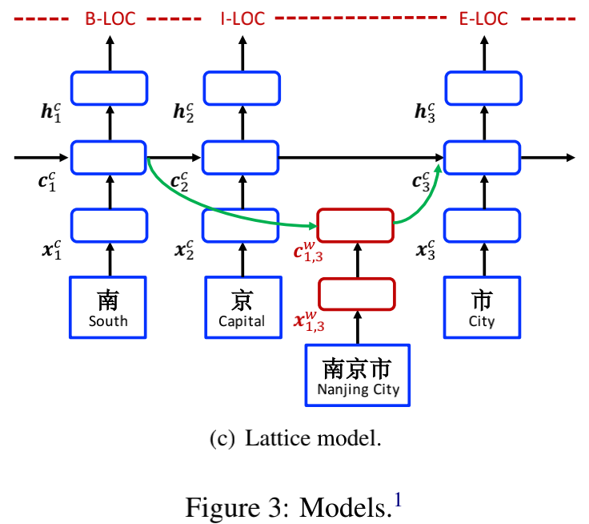

​	如图 Figure3，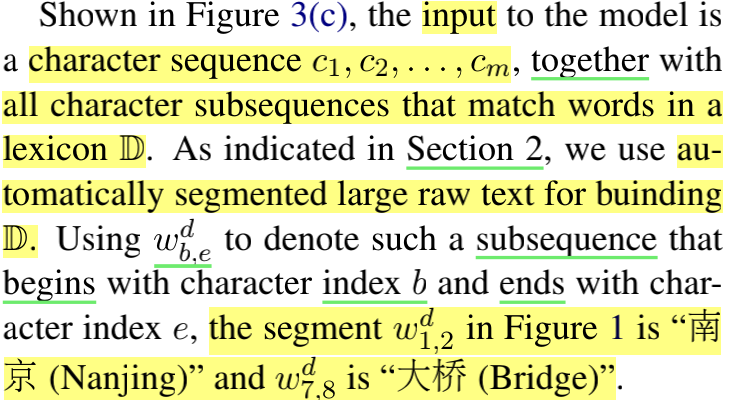

​		1、模型输入的是 **字符序列**（ character sequence ）c1,...,cm ， 以及与**词库D中的单词相匹配的所有字符子序列**。（a character sequence *c*1*, c*2, . . . , cm, together with all character subsequences that match words in a lexicon D）

​		2、在**四、Related Word第4段**使用**自动分割的大型原始文本来建立D**  （we use automatically segmented large raw text for buinding D.）

​		**3、模型有四种类型的向量**：

​		   *input vectors*,      *output hidden vectors*,      *cell vectors*     and      *gate vectors*

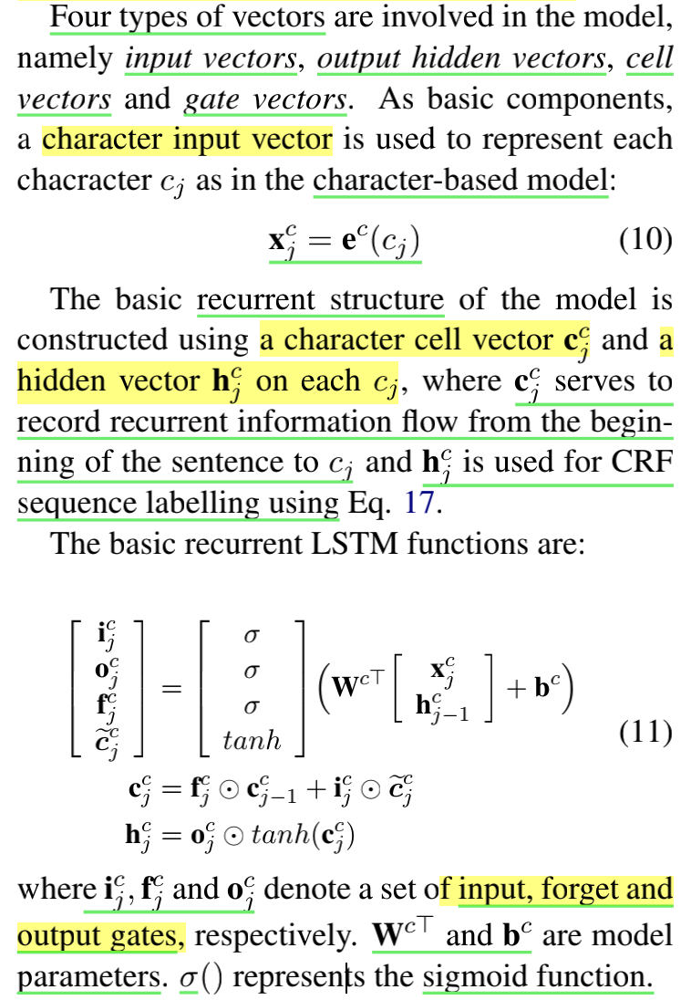

​		（1） *input vectors*，与 character-based model 不同的是，计算c 考虑了词库子序列w。

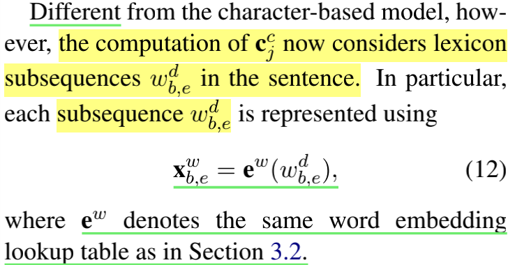

​		（2）*cell vectors*，有更多的循环路径（ more recurrent paths）到字符c。

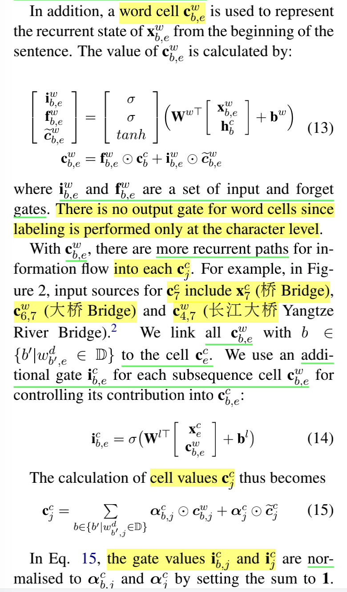

​		（3）*gate vectors*，---------》nomarlised 到和为1。

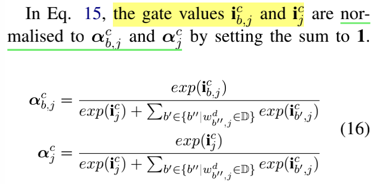

​		（4）*output hidden vectors*，通过等式11计算，在 NER 训练期间，损失值反向传播到参数 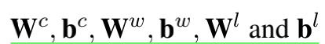，允许模型在 NER  labelling期间**动态关注更相关的词**。

### 3.4 **Lattice Model**

​		在 h1, h2, . . . , hτ 之上使用标准的 CRF 层，其中 τ 对于 **基于字符 和 lattice-based 的模型是 n**，对于 **基于词** 的模型是 **m**。

​		使用**一阶维特比算法**在基于单词或基于字符的输入序列上找到得分最高的标签序列。 给定一组手动标记的训练数据 {(si, yi)}|Ni=1，使用 L2 正则化的句子级对数似然损失来训练模型：

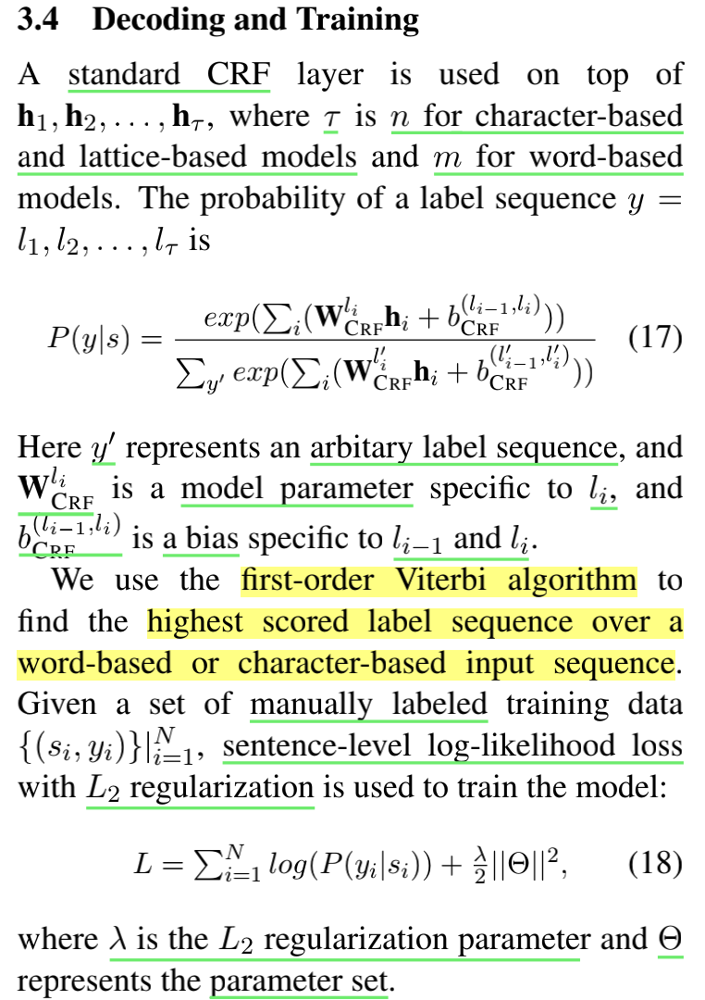

## 六、**Experiments**

​				进行大量实验，研究跨不同领域的 **基于字符 lattice LSTM** 的有效性。此外，目标是在不同的设置下，对基于词和基于字符的神经中文NER进行经验性比较（word-based and character-based neural Chinese NER under different settings），精确率（P）、召回率（R）和F1分数（F1）作为评价指标。

###  **1、Experimental Settings**

**（1）Data**：（四个）

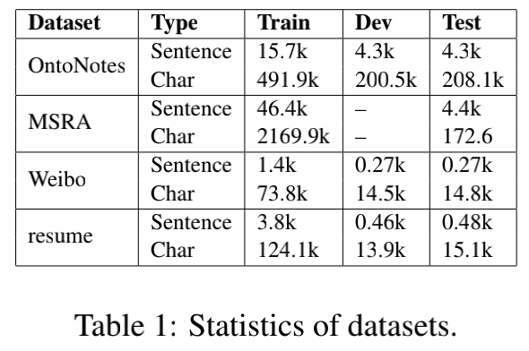

​	

a、**OntoNotes** 和**MSRA** 数据集在新闻领域，**微博 NER** 数据集来自社交媒体网站新浪微博，以及自己标注的**中文简历**（resume）

​	b、自己标注的**中文简历**（resume）：为了测试领域的更多样，我们从新浪财经收集了一份简历数据集，其中包括中国股市上市公司高管的简历。 我们随机选择了**1027 份简历摘要，并手动标注了 8 种命名实体**。 数据集的统计数据如表 2 所示。注释者间的一致性为 97.1%。 我们发布此数据集作为进一步研究的资源。

​	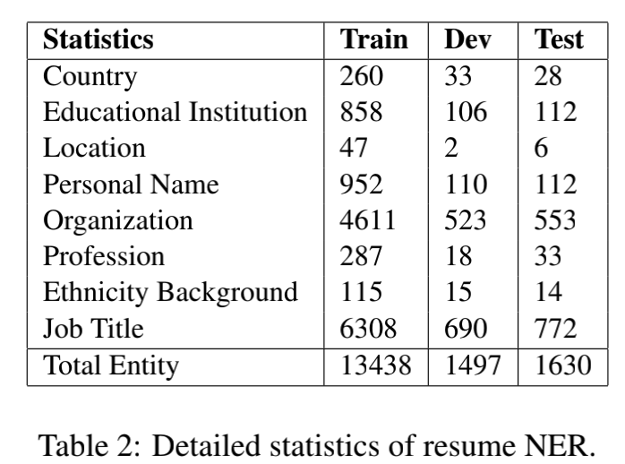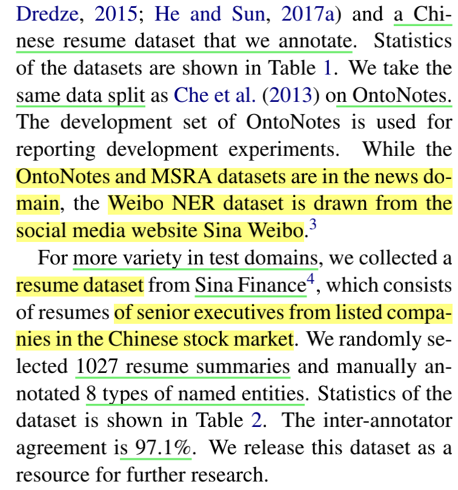

**（2）Segmentation**

​				 OntoNotes 、 MSRA  使用  gold-standard segmentation 在 train 可用；

​				 OntoNotes 使用  gold-standard segmentation 在 dev、test 可用；

 				MSRA 的 test 没有分割，也没 微博/简历数据集-----》用OntoNotes研究 gold-standard segmentation。

​					使用 Yang et al. (2017a) 的**神经单词分割器**来自动分割  word-based NER 的 dev 和 test。 gold segmentation 训练使用OntoNotes 、 MSRA 的 train。

​				微博 和 简历 使用最优模型 Yang et al. (2017a)，使用 CTB 6.0  训练的

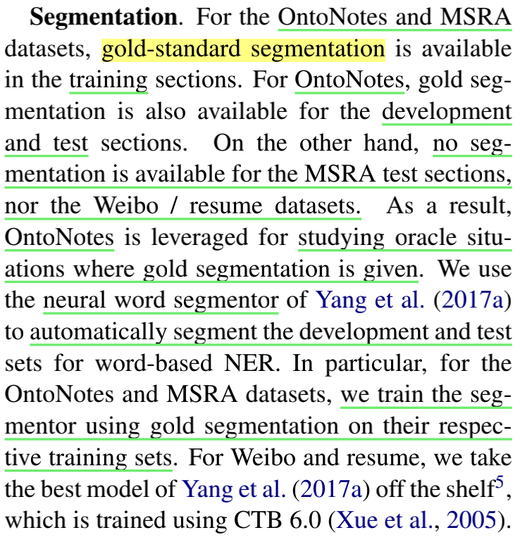

**（3）Word Embeddings**.

​		使用 word2vec (Mikolov et al., 2013) 在自动分割的中文 **Giga-Word **上预训练词嵌入，在最终词典中获得 **704.4k 个词**。 其中**单字、二字、三字的字数分别为5.7k、291.5k、278.1k**。 嵌入 lex 图标与我们的代码和模型一起发布，作为进一步研究的资源。嵌入词典与我们的代码和模型一起发布，作为进一步研究的资源。 词嵌入在 NER 训练期间进行了微调。 使用 word2vec 在中文 Giga-Word 上预训练字符和字符二元嵌入，并在模型训练中进行微调。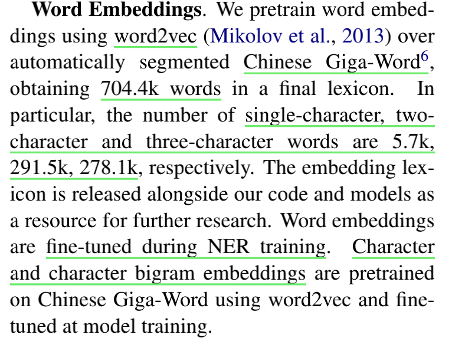

**（4）Hyper-parameter settings**.

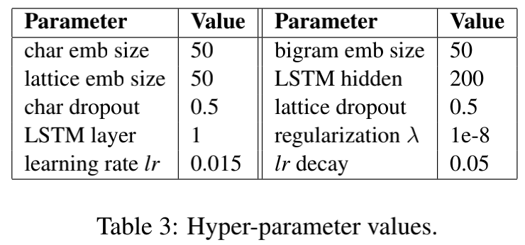

​			模型超参数根据之前的工作固定的，没有对每个单独的数据集进行网格搜索调整。

### **2、**Development Experiments

**OntoNotes（dev表4）**		

​	在 OntoNotes 的 dev 上比较了各种模型配置，以便为 基于词 和 基于字符 的 NER 模型选择最佳设置，并了解格词信息（ lattice word）对基于字符的模型的影响。

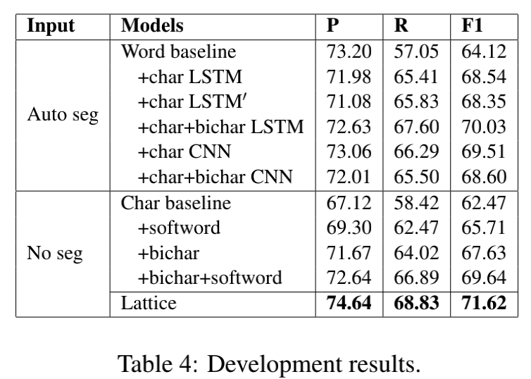

**（1）Character-based NER**	（表4）		

​		1、	**不分词**的情况下，**基于字符** 的 **LSTM-CRF** 的 dev 的 F1 分数为**62.47%**

​		2、	**添加**如第 3.1 节**character-bigram 和 softword representations**将 F1 分数分别增加到 **67.63%** 和 **65.71%**

​	**表4得出结论**：

​			**两者**的结合给出了**69.64%** 的 F1 分数，这是各种字符表示中最好的。 

​			因此，在剩余的实验中选择了这个模型。

**（2）Word-based NER**	（表4）	

​			基于词的中文 NER 的各种不同设置。 

​		①**LSTM**

**表4得出结论**

​		1、通过自动分割，**基于词的 LSTM CRF 的 baseline F1 分数 64.12%（高于 基于字 的baseline）**，单词信息和字符信息对中文 NER 都很有用。 

​		2、第 3.2 节中使用字符 LSTM 来丰富单词表示的两种方法，即 **word+char LSTM 和 word+char LSTM'**， lead to similar improvements

​		②**CNN**

​		字符序列的 CNN 略高于LSTM，进一步使用**bichar**组信息导致 F1-score 高于 word+char LSTM，但 F1-score 低于 word+char CNN。 **一个可能的原因是 CNN 固有地捕获字符 n-gram 信息**（ A possible reason is that CNN inherently captures character n-gram information.）。 

**结论**

​		在**剩余的实验中使用 word+char+bichar LSTM 进行基于词的 NER**（其在 dev 上的**F1-score 最好**），并且在结构上与文献中最先进的英语 NER 模型一致。

**（3）Lattice-based NER**	（图4、表4）	

​			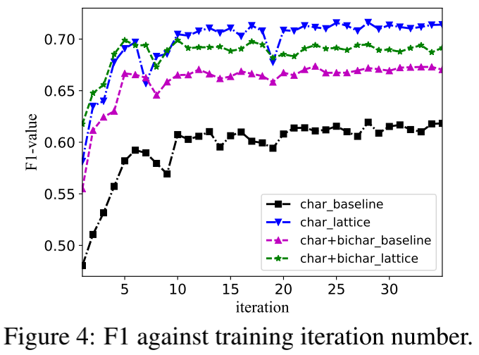

​	图4 ：基于字 和 基于 lattice 模型**F1-scorce 与 训练迭代次数的关系**，使用 **concatenated character and character bigram embeddings**（其中，bigram 对字符消歧起重要作用）。

**图4得出结论：**

​			1、在  character-based NER 上，从  62.5%   涨到   71.6%，**Lattice 有用**

​			2、 bigram-enhanced  对 **Lattice 没进一步提高**（可能原因：**词对字符消歧比 bigram 更有效**）

**表4得出结论：**

​			1、**Lattice LSTM-CRF**  71.62%，明显高于 基于词 和 基于字 的方法（**没有使用bigram 和 segmentation**）

​			2、优于char+softword ，表明**lattice word比分词信息（segmentor word）更有优势**

### **3 、Final Results（总结：lattice 优于基于词、基于字的模型）**

**（1）OntoNotes（test表5）**		

**表5得出结论：**

​			1、gold seg的情况下，**LSTM-CRF对于基于词的中文NER有竞争力的选择**

​			2、在 auto seg的情况下，word+char+bichar LSTM  从75.77% **降**到 71.70%，说明**分词对NER的影响**

​			3、与dev结论一致，在 基于字的baseline 上，**lattice 信息**比**bichar + softword**更好

**（2）MSRA（dataset表6）**

​	test没有 gold standard segmentation，选择在 5折交叉验证的训练集上准确度95.93%的分词器

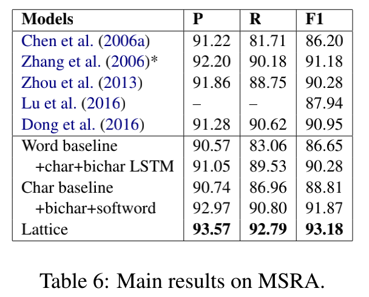

​		1、现有的方法

​			①最好的统计方法： leverage rich handcrafted features     (Chen et al., 2006a; Zhang et al.,2006; Zhou et al., 2013)

​			②神经网络：character embedding features (Lu et al., 2016). Dong et al. (2016) exploit neural LSTM-CRF with radical features

​		2、**表6得出结论：**

​				基于词和基于字的 LSTM-CRF 的准确率与现有相差不大；

​				lattice model 最好

**（3）Weibo/resume.（dataset表7、8）**

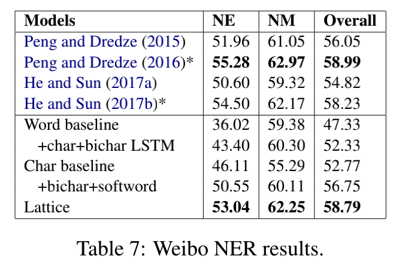

**表7（微博 dataset）得出结论：**

​				，没有Gold-standard segmentation，现有先进方法（探索 rich embedding features, cross-domain and semi-supervised data）与我们方法正交、不交叉（orthogonal ）

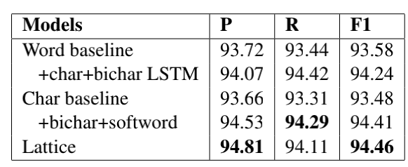

**表7、表8（resume NER test）得出结论：**

​				 与OntoNotes 、 MSRA 一致，微博 和 resume 都是 lattice 优于基于词、基于字的模型

### **4 、Discussion**（	**对长度不友好，源于分词；对 NER model正确分词重要，lattice能选择更多正确的分词在 NER 训练中。**）

**1、F1 against sentence length**（句子长度对F1的影响）

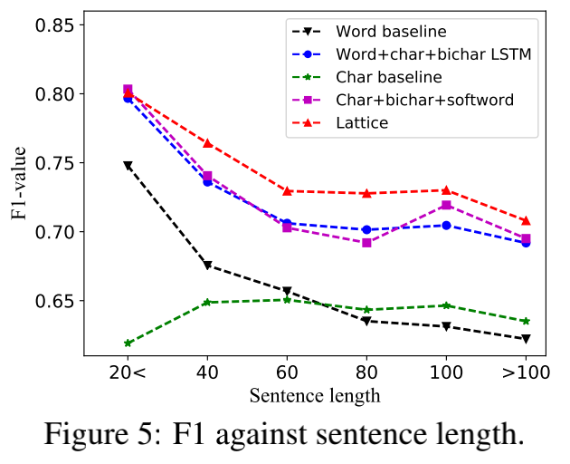

图5（ F1-scores of the baseline models and lattice LSTM-CRF on the **OntoNotes dataset**）：

**图5得出结论**：

​			**基于字的baseline** （绿色）不同长度的 F1稳定；

​			**基于词的baseline **（黑色） 对短句友好，长句很差（原因：低准确率的分词器）；

​			**word+char+bichar（蓝色） 和 char+bichar+softword（粉红）**比基于词和基于字的baseline好

​			**基于词的baseline **（红色） 长度长，F1低（原因：lattice中的单词组合数量呈指数增长）；

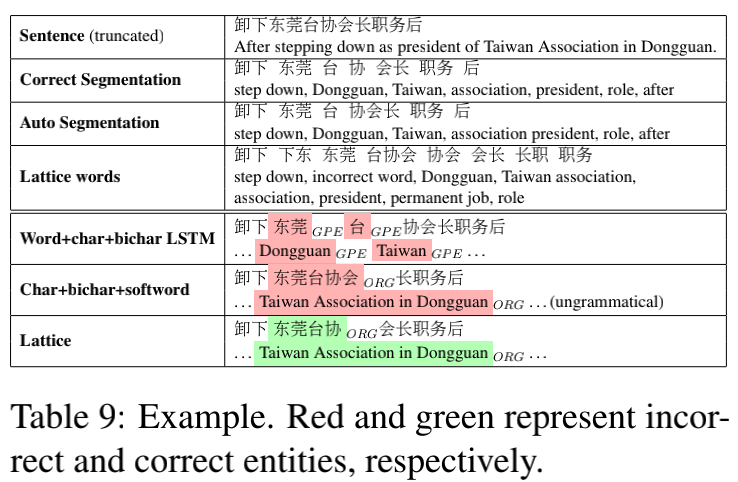

表9（一个例子：卸下东莞台协会长职务后）

**表9得出结论**：

​					非常模糊  的  命名实体（东莞台协），

​					**Word+char+bichar**：东莞     台   （原因：东莞台协  不在分词中）

​					**Char+bichar+softword**：东莞台协会   （单独看合理，整体上不合理）

​					 **lattice model**：东莞台协  （因为lattice word 包含 东莞、会长，不相关的词 台协会、下东不影响其结果）

​					**word+char+bichar** 和 **lattice**相同的预训练过的词嵌入词典，但 **前者先使用分词的词库（即对子序列有硬性约束）**，**后者自由考虑词库中所有的词**

**2、Entities in lexicon**

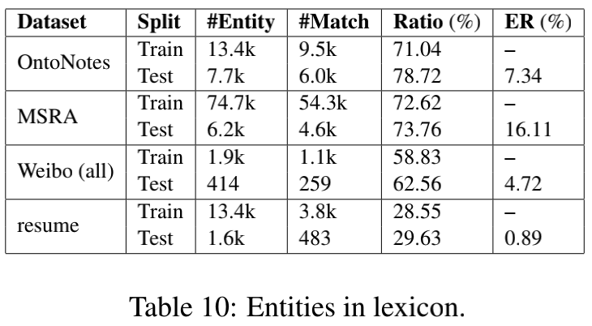

表10（词库中的实体总数和它们各自的匹配率）

​					错误率（ER）与匹配率（Ratio）有关，我们的自动词典有一定的作用（extent the role of a gazetteer），**消歧**主要还是依靠**lattice 和 监督学习**。

​	

### 七、今后的工作：

​				**We leave the investigation of such influence（lattice能选择更多正确的分词） to future work。**

