# Long Short-Term Memory with Dynamic Skip Connections

## 一、Abstract

**1、背景：**

 				近年来，长短时记忆(LSTM)被成功地用于建模变长序列数据。然而，LSTM在捕获长期依赖项时仍然会遇到困难。（In recent years, long short-term memory (LSTM) has been successfully used to model sequential data of variable length.However, LSTM can still experience difficulty in capturing long-term dependencies. ）

**2、提出**

​					缓和 LSTM 上述问题，提出 **动态跳跃连接** （ a dynamic skip connection），它可以学习直接连接两个依赖的单词（ learn to directly connect two dependent words）

**3、做法**

​					由于训练数据中没有依赖信息，我们提出了一种新的  **基于强化学习**  的**依赖关系建模和连接依赖词**的方法。（ propose a novel reinforcement learning-based method to model the dependency relationship and connect dependent words.）

​				该模型**基于跳跃连接计算循环传递函数**( computes the recurrent transition functions based on the skip connections)

​				相对于总是顺序处理整个句子的rnn具有动态跳跃的优势。		

**3、模型优势**

​				相对于总是连续地处理句子的rnn，模型有 **动态跳跃的优势**（ provides a dynamic skipping advantage over RNNs that always tackle entire sentences sequentially）

**4、实验表明**

​				在三种自然语言处理任务上的实验结果表明，该方法能够取得比现有方法更好的性能。在数字预测实验中，该模型的准确率比LSTM高出近20%。（In the number prediction experiment, the proposed model outperformed LSTM with respect to accuracy by nearly 20%.）

##  二、Conclusion

​				提出一种基于强化学习的LSTM模型，该模型使用**动态跳跃连接**扩展现有的LSTM模型。( extends the existing LSTM model with dynamic skip connections)

​				该模型可以**动态地从过去的几个状态中选择一组最优的隐藏状态和细胞状态**。（The proposed model can dynamically choose one optimal set of hidden and cell states from the past few states）

​		**优点：**				

​		1、通过动态跳跃连接（dynamic skip connections）

​			该模型比固定跳跃的句子具有更强的建模能力，并能解决语言中**可变长度的依赖问题**（the model has a stronger ability to model sentences than those with fifixed skip, and can tackle the dependency problem with variable lengths in the language）

​		2、梯度反向传播路径较短（shorter gradient backpropagation path）

​			该模型可以缓解梯度消失带来的挑战（the model can alleviate the challenges of vanishing gradient）

**图1：解释LSTM或跳跃连接LSTM捕获信息困难**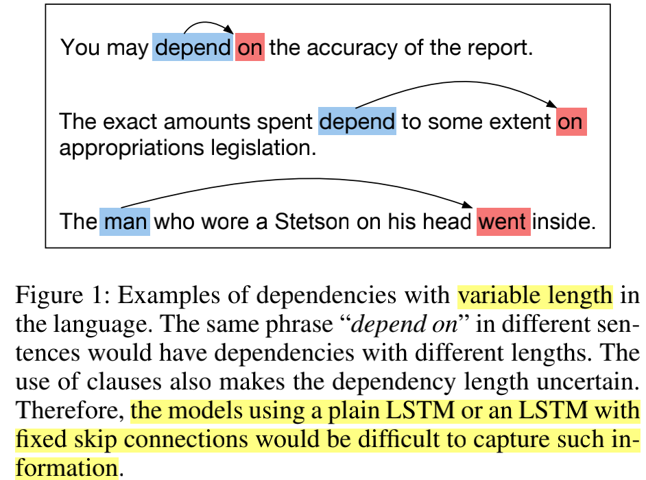

**图2：本文的模型框架，例如：*depend to some extent on* 中选择 depend 去预测 on **

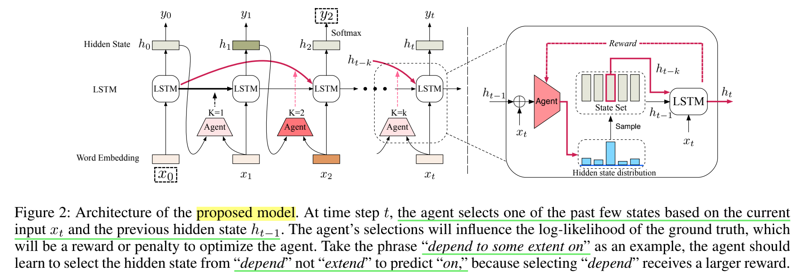

## **三、Dynamic Skip with REINFORCE**

### 1、概述

模型分为2部分：

​	（1） **（核心core）一种梯度的策略，从历史的state中选择最佳state**（a policy gradient agent that repeatedly selects the optimal *State* from the historical *State* set）

 				训练优化参数：	policy gradient agent   ***θa***

​	（2） **一种标准LSTM使用新选择的state来实现一个任务**（a standard LSTM cell (Hochreiter and Schmidhuber 1997) using a newly selected State to achieve a task）

 			 	训练优化参数：   parameters of LSTM  

​												possibly other parameters inclede word embeddings denoted as ***θl***

**做法**

​	对 序列  X 1-T ，T为句子长。

​	每个时间 t ， agent 与 st 进行交互决定  at（**确定哪个state进入标准的LSTM**）,模型根据当前选择的reward来更新agent中的参数。

### 2、详细 agent

​	有4个重要的点：①the environment representation  ***st***

​								 ②the action ***at*** 

​								 ③the reward function

​								 ④the recurrent transition function

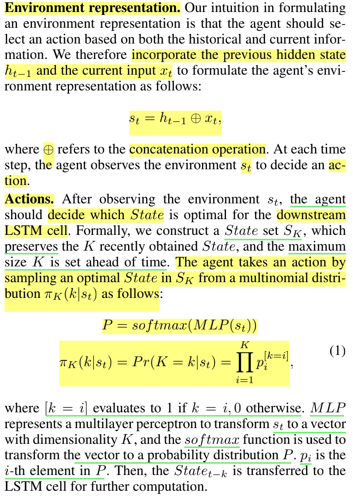

**（1）the environment representation  ***st*****

​					合并历史和当前信息：（**拼接**）

**（2）the action ***at*** **

​					通过从多项式分布 πK(k|st) 中采样 SK 中的最佳状态，

​				**①MLP：st——》维度K的vector**

​				**②sofrmax：维度K的vector——》概率分布P**

​				**③LSTM：*State**  t-k***——》LSTM中下一步计算**

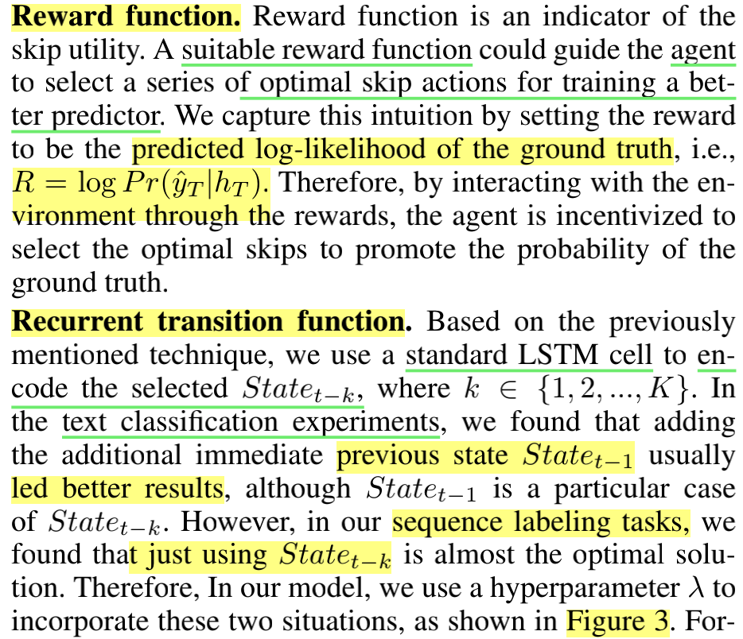

**（3）the reward function**

​					指导agent选择一系列最优的跳过动作来训练一个更好的预测器，通过**真实情况的预测对数似然**

**（4）the recurrent transition function**

​					通过标准的LSTM对选定***State**  t-k*	编码。

​					在**文本分类**实验中，额外添加前一个状态***State**  t-1*效果更好；

​					在**序列标注**实验中，只使用选定的 ***State**  t-k*；

​					因此，**超参数 λ 来合并这两种情况（也就是0不添加前一个状态，1为添加）**。

如图3

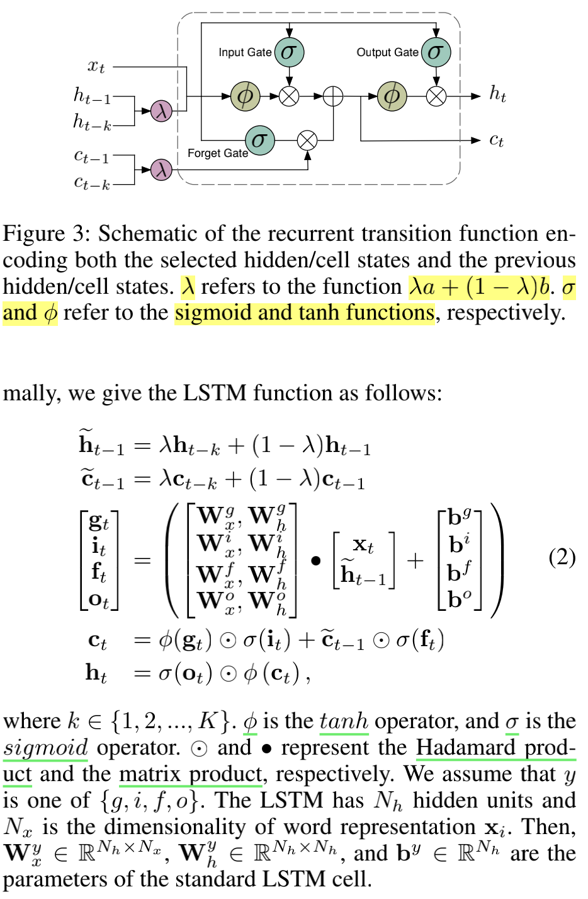

## 四、Training Methods

**1、训练优化参数**：①policy gradient agent   ***θa***

​						   ②parameters of LSTM  

​						   ③possibly other parameters inclede word embeddings denoted as ***θl***（前向传播，可视为分类问题）

**2、反向传播**：损失函数（最小），优化 ***θl***：

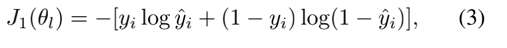

**3、  expected reward（最大）**：**带有熵项（entropy item）的强化学习**优于基于注意力的连接

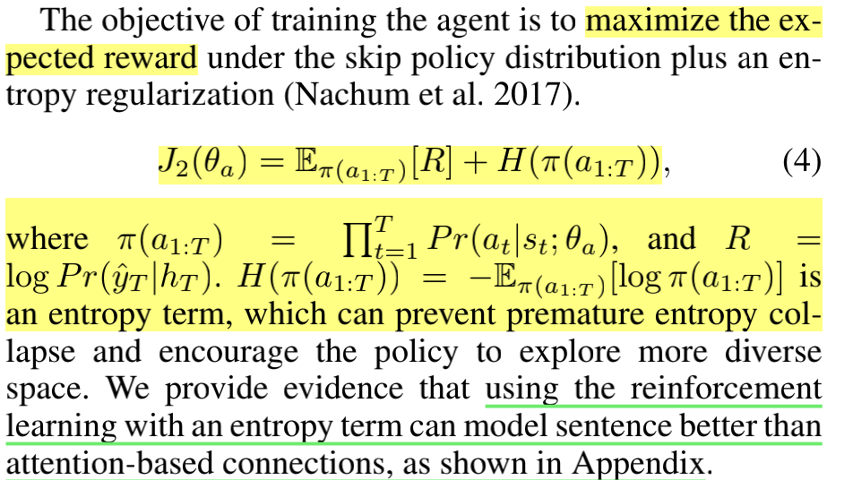

​				**熵项**（entropy item）：防止过早的熵崩溃并鼓励政策探索更多样化的空间（which can prevent premature entropy collapse and encourage the policy to explore more diverse space.）

**4、优化策略**：

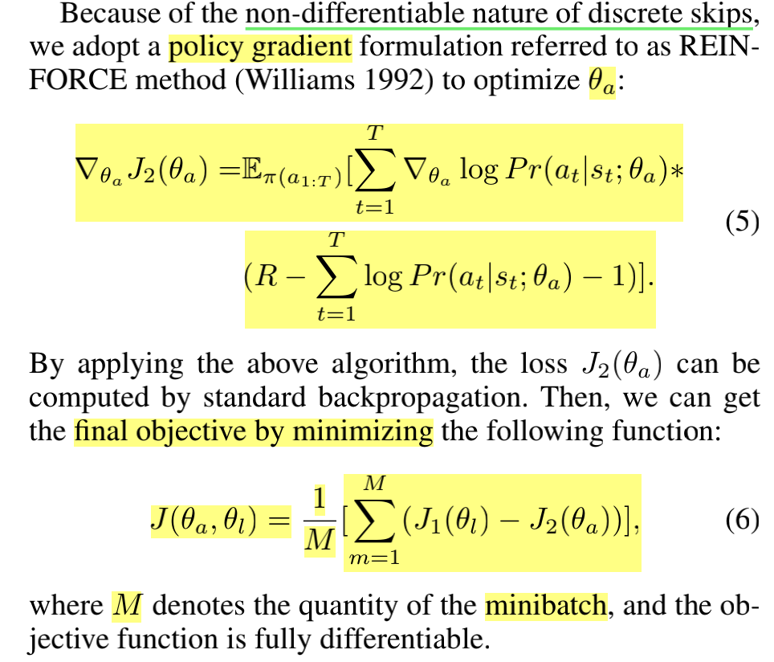

​			**跳跃不可微，策略梯度公式（ policy gradien） 使用 REINFORCE的方法**，优化参数  ***θa***

### **五、Experiments and Results**

**表1：实验的数据集**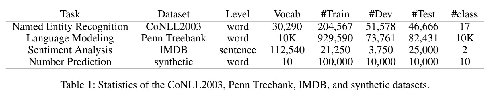

### **1、General experiment settings**

​					相同的超参数和优化器

​					 policy gradient agen：使用单层MLP包含50个隐藏单元

​					最大skip   K 和   固定的超参数   *λ* 

### **2、NER**

（1）**数据**：公开的英语  CoNLL 2003（四种类型实体：人名、地名、组织名、其他）

​		**标签**： BIOES

​		**初始化**： 100维的GloVe 词向量  和  未处理的字符 embedding 

​		**模型**：一个前向和后向的新 LSTM 层（λ = 1，K = 5）和一个 CRF 层来完成这个任务 

​		**reward**：crf中真是抱歉的概率

​		**早停**： valid 上

​		**时间**：Ma and Hovy (2016)  最好结果50 个 epochs 和所需的模型训练8小时

​					本文：更多的探索，最好结果65 个 epochs 和所需的模型训练9.98小时

（2）**实验结果如表2**：

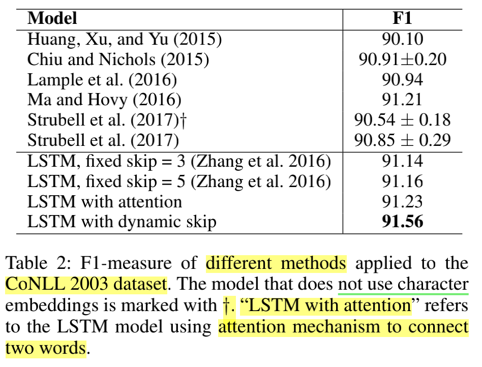

​					以前 F1最好(91.21) ：**双向 LSTM、CNN 和 CRF 的组合来自动获得词级和字符级表示** (Ma and Hovy2016)	；

​					加入额外的固定的skip的bilstm表现不会提升；

​					使用动态的skip模型性能得到提升（模型平均提高了 0.35% 的性能，并且错误减少率超过了 4%），优于注意力模型。

​		**原因**：

​				**注意力模型**使用确定性网络来计算对**对齐变量的期望**，即 log f(H, Ek[k])，而不是对**特征的期望**，即 log Ek(H, k)，这两种预期之间的差距可能很大。**我们的模型相当于（Deng et al. 2018）中的“Categorical Alignments”模型，可以有效地解决上述缺陷。详细证明见附录**

（3）**比较标准 LSTM 和提出的模型之间的长期梯度值来研究梯度消失的问题**

​			计算平均梯度范数（average gradient norms）： (Mujika, Meier, and Steger 2017)   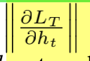

**在每个时间步长 t 相对于隐藏状态 ht 的时间 T 的损失**

​			通过用所有时间步的平均梯度范数之和对平均梯度范数进行**归一化**，来可视化**前 20 个时间步长**中的梯度范数，如图4：

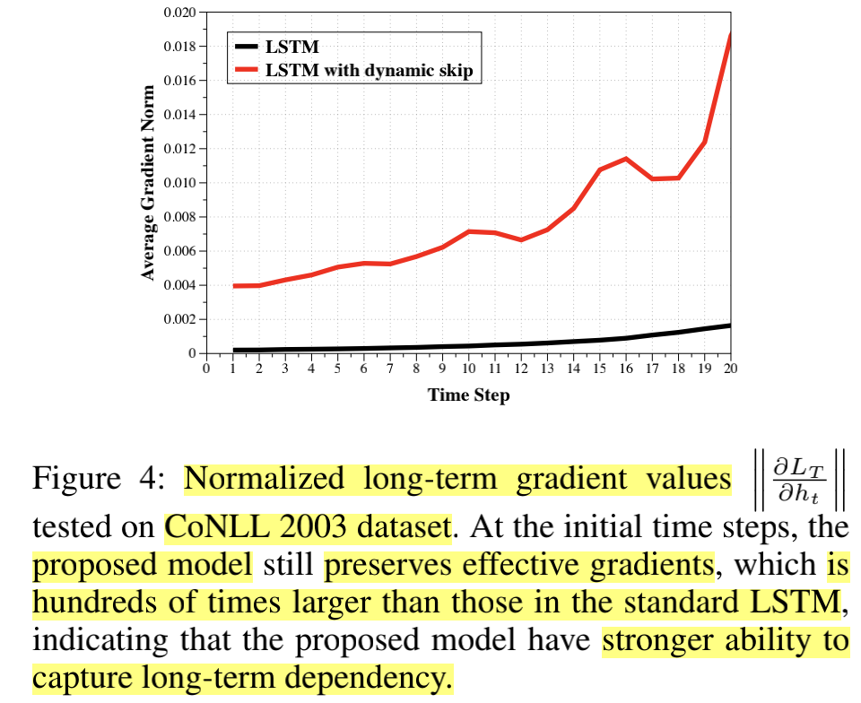

​			**结论**：

​						初始，保留了有效的梯度反向传播；平均梯度范数比标准 LSTM 中的大数百倍；**提出模型捕获长期依赖**

### **2、language model**

​       模型在**Penn Treebank 语言模型语料库（详情表1）**（Marcus、Marcinkiewicz 和 San torini 1993）上进行评估，**预测序列中的下一个词**

​		（1）模型： **正则的LSTM**(Zaremba, Sutskever, and Vinyals 2014) and **CharLM** (Kim et al. 2016)）		

​		（2）参数等：

​			①相同：					

​					2层650个单元的LSTM       （two layers of LSTM with 650 units）

​					权重初始化在 [-0.05, +0.05]    weights are initialized uniformly [-0.05, +0.05]

​					学习率：最初  1.0    （35个时间步长，使用SGD）

​					梯度的范数： 5 以下		

​					dropout：0.5输入到隐藏层 和 隐藏层到输出层  （the LSTM input-to-hidden layers and the hidden-to-output softmax layer）	

​			②两模型不同：

​						前者：词输入 ； 后者：字符输入

​			（3）本文实验：

​						将上述基线模型中的**第二层 LSTM** 替换为**固定跳跃 LSTM** 或我们提出的模型（**动态跳跃**）

​			（4）实验结果（表3）

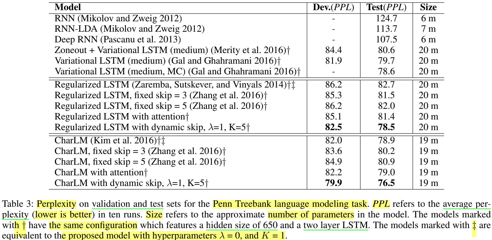

结论：

​		①**固定的skip**的 LSTM

​			**简单任务（好）**，可能非常强大（Zhang et al. 2016），如：添加问题、复制内存问题和顺序 MNIST 问题（adding problem, copying memory problem, and sequential MNIST problem）

​			在**复杂的语言环境（差）**中，固定跳过长度受到其无法利用可变长度依赖项的限制

​		②针对**复杂的语言环境（差）**，使用**动态跳过长度（dynamic skip）**

​			a、都优于baseline，最好的模型困惑度 82.7 to 78.5，和 78.9 to 76.5；

​			b、本文模型中的**λ**和**K**对模型的影响

​				**λ** 是一个权重，来**平衡新选择的状态和前一个状态之间的效用状态**， K 表示跳过空间的大小

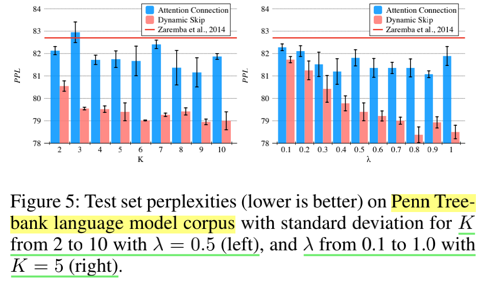

​			**图5结论：**

​						**较大**的**λ**和**K**，PPL更好，鲁棒性更好（并且有利于所选状态的平衡和更大的搜索空间而产生更大的方差）

​			**图6（例子：预测基于长期依赖的介词）**

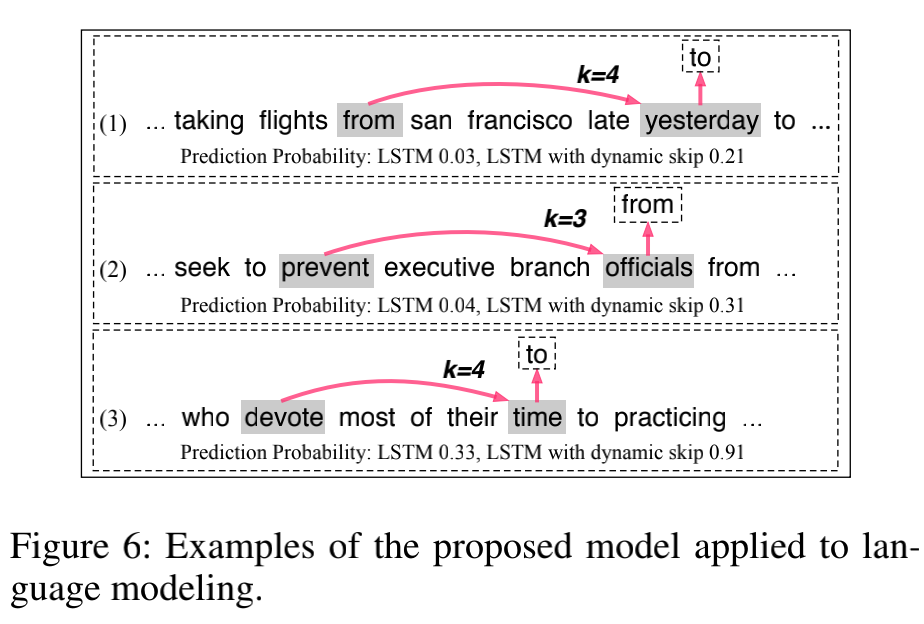

​				图中，**标准的LSTM**很难根据上一个state预测3句话中各自的介词；

​							**动态的跳跃长度**（可以）

## **3、**Sentiment Analysis on IMDB

### （1）背景：

​	与本文模型相似的工作 Jump LSTM (Yu, Lee, and Le 2017) and Skip LSTM (Campos et al. 2017) 

​		文本分类（效果好）；

​		序列建模任务，如：language modeling 和 NER（不能使用）

​					原因：跳跃特性和跳过状态更新的性质使得模型无法为跳过的标记生成 LSTM 输出，也无法分别更新隐藏状态（because the jumping characteristics and the nature of skipping state updates make the models cannot produce LSTM outputs for skipped tokens and cannot update the hidden state）

### （2）在 sentiment analysis 任务，比较上述2个模型

① 数据:电影评论------------**IMDB 数据集 (Maas et al. 2011)**：

​			train:    25,000   (其中 约 15% 作为 dev)

​			test:      25,000

​			句长：240（平均）

②建模：

​			**proposed model     Jump LSTM        Skip LSTM      LSTM**					

​			1层，128个hidden单元；

​			batch size ： 50

​			预训练的Word2vec 或     U     (0.25, +0.25)  中随机初始化

​			dopout：0.2（LSTM最后一层和分类层之间）

​			max length：400

​			*λ* and *K*：   0.5 和 3

③结果（表4）：

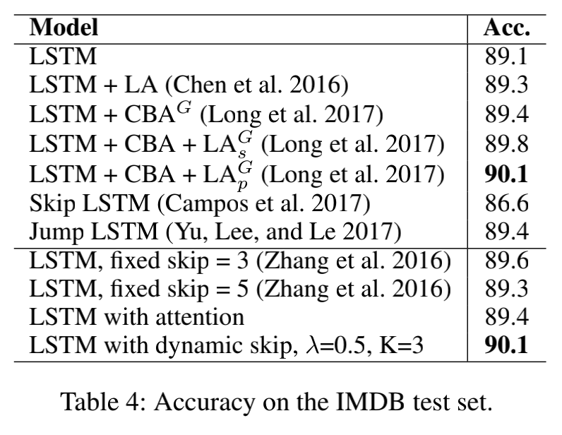

​			Chen et al. (2016)  ：局部语义注意的思想（the idea of local semantic attention）

​			Long et al. (2017)：  基于认知的注意力模型（cognition based attention model, which needed additional eye-tracking data）

​	**结论：**

​			提出模型：文本分类（好，优于标准LSTM 1%，优于  Jump LSTM and Skip LSTM）

​			**语言建模 、 命名实体识别等 、文本分类---------------好**

## 4、**Number Prediction with Skips**

​				**研究具有动态跳跃连接的 LSTM 确实能够在文本中给出明确的跳跃信号时学习如何跳跃**

（1）新任务，类似 (Yu, Lee, and Le 2017)，

​				xT-1是跳过信号，引导网络引入第xT-1的整数作为预测标签的输入。理想的网络应该学会忽略剩余的无用数字，并学会如何从训练数据中跳过。

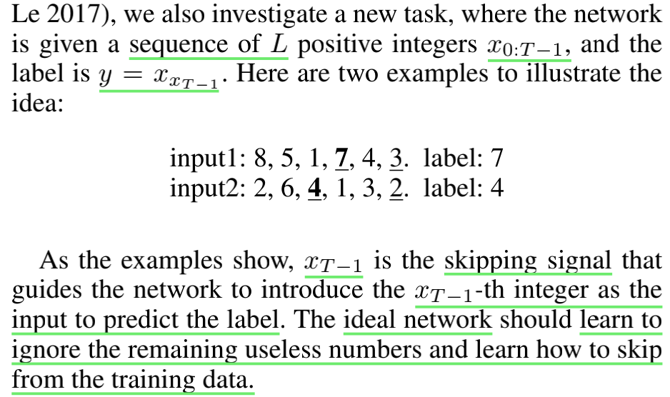

（2）数据（生成）与 建模

​				train：100,000

​				valid：10,000

​				test：  10,000

​				长度 T ： 11（从0-9中抽样出11个整数）

​				输入： one-hot vector

​				模型：LSTM or Dynamic LSTM（最后一层隐藏状态用来预测，采用一层LSTM 200 hidden 单元）

​				Adam optimizer      cross-entropy loss       learning rate(0.001)

(3)结果（表5）

​		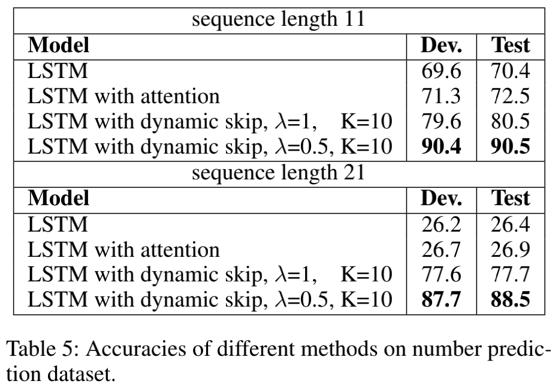

​	**结论：①对于简单任务（句长11），LSTM无法达到高精度，而动态的可以**

​				**②增加任务难度（两次跳过来寻找标签，句长21），动态的远远超过LSTM**

## 六、**Related Work**

​		**RNN的长依赖问题**

​		（1）门控机制（Hochreiter 和 Schmidhuber 1997；Chung 等人 2014）

​		多时间尺度机制（Chung、Ahn 和 Ben gio 2016）

​		跨多个时间步长的跳跃连接的使用（Zhang et al.2016；Chang et al.2017）

​		Zhang et al. (2016)  引入了循环跳跃系数，它捕捉信息随时间传播的速度，并发现提高循环跳跃系数主要可以提高模型在长期依赖任务上的性能

​		**以上：固定跳过长度**

​		（2）**本文： 动态决定跳跃长度的强化学习方法**

​		（3）其他将强化学习引入循环神经网络  Jump LSTM (Yu, Lee,and Le 2017), Skip RNN (Seo et al. 2017), and Skim RNN (Seo et al. 2017)

​			**Jump LSTM**： 旨在通过在**需要时跳过不相关的信息来降低 RNN 的计算成本**。 他们的模型学习应该省略多少单词，这也使用了 REINFORCE 算法

​			**Skip RNN** 和 **Skim RNN**：学习使用**完全可微**的方法跳过（部分）状态更新。

​		（4）总结（模型与（3）中的不同）：

​					**Jump LSTM** 无法为跳过的标记生成 LSTM 输出，并且 **Skip (Skim) RNN** 不会更新（部分）隐藏状态。 因此，三种模型很难用于序列标记任务。 与它们相反，**我们的模型每次都更新整个隐藏状态**，可适用于序列标注任务。