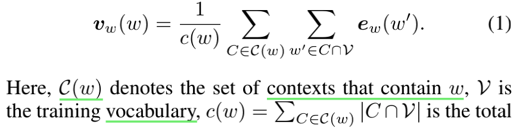
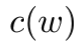

# Learning Task-Specifific Representation for Novel Words in Sequence Labeling

代码：https://github.com/v-mipeng/TaskOOV

## 一、Abstract

**1、背景：**

 				词表征是基于神经网络的序列标注系统的关键组成部分（Word representation is a key component in neural-network-based sequence labeling systems）。然而，在最终任务中训练的 **未见单词或稀有单词** 的表示通常在可欣赏的表现上 **很差**（representations of unseen or rare words trained on the end task are usually poor for appreciable performance）。这通常被称为词汇表外(OOV)问题。（ ）

**2、提出**

​			只使用任务的训练数据来解决序列标注中的OOV问题，提出了一种新的方法（**新的教师-学生范式，见二、3小节**）来预测OOV词的表示法(如字符序列)和上下文。（predict representations for OOV words from their surface-forms (e.g., character sequence) and contexts）

​			该方法是专门为避免同一范式中现有方法所遭受的错误传播问题而设计的。（The method is specififically designed to avoid the error propagation problem suffered by existing approaches in the same paradigm. ）		

**3、实验表明**

​				为评估的有效性，我们对四个词性标注任务和四个命名实体识别任务进行了广泛的实证研究。

​				与现有方法相比，所提出的方法可以获得更好或更具竞争力的性能。（Experimental results show that the proposed method can achieve better or competitive performance on the OOV problem compared with existing state-of-the-art methods.）

##  二、Conclusion

​				只使用任务的训练数据来解决序列标注中的OOV问题，该方法被设计用来从OOV单词的表面形式和上下文生成它们的表示（It is designed to generate representations for OOV words from their surface-forms and contexts.），其设计是为了避免现有方法在同一范式下所遭受的误差传播问题（it is designed to avoid the error propagation problem suffered by existing methods in the same paradigm）。

​				实验表明，在词性标注(POS)和命名实体识别(NER)方面的大量实验研究表明，该方法在OOV问题上的性能优于现有方法。

## 三、**1 Introduction**

### 1、背景

近年来，**解决OOV问题**的方法（两类）：

（1）**在非常大的原始文本语料库上预训练词向量（语料充足）**  [Mikolov et al., 2013; Pennington et al., 2014; Peters et al., 2018]      [Devlin et al., 2018]

（2）**进一步利用任务的训练数据**。（further exploiting training data of the task）

​		**技术领域和生物/医学领域 ** 语料少[Deleger ˙ et al., 2016]

​		做法：

​		①、**流行做法是用单个共享嵌入表示所有 OOV 词，该嵌入在训练集中的低频词上进行训练，然后在测试时分配给所有 OOV 词**

​			其缺点：混淆了许多词，从而丢失了 OOV 词的特定信息

​		②、**从其表面形式（例如，字符序列）中获取单词表示 [Ling et al., 2015]**

​			优点：**捕捉语态派生的语义**，如：从“run”中提取“running”

​			缺点：**在捕捉句法上相似但语义上不相关的词（例如 "run "与 "rung"）之间的语义区别**方面不好

（3）最先进的序列标注系统

​			**结合 表面形式的表示与独特的嵌入**表示该词，

​			**但又出现了OOV问题**

### 2、第二方向的新范式（教师-学生范式）

​		分两步：

​		①训练一个有监督的模型（在这项工作中也称为**教师网络**），对这些词汇内的标签进行预测，以获得其任务特定的词汇表征

​		②训练（或启发式地构建）一个预测模型（也称为**学生网络**），从一个词的表面形式[Pinter等人，2017]、上下文[Lazaridou等人，2017]或两者[Schick和Schutze，¨2018]预测其表征

​		**学生网络的训练对象通常是重构那些词汇内的表征**

​	**使用**：

​			①在测试时，当遇到句子中的OOV词时，学生网络来预测这些OOV词向量

​			②根据生成的OOV词向量，教师网络来进行标签预测。

​	**缺点**：

​			受到管道范式的典型错误传播问题的影响 [Caselli et al., 2015;Bojarski et al., 2016]

​			(因为用于训练 不保证学生网络与用于训练教师网络的监督对象完全兼容)

### 3、提出新的教师-学生范式

​			专门用于解决错误传播问题（specifically designed to address the error propagation problem）

（1）**新**（主要的不同）：

​			在于学生网络的训练，**不是重建那些词汇内单词的表征**，而是训练学生网络来**预测可以在监督任务上取得良好性能的单词表征**

（2）做法

​		学生网络的训练信号直接由参数固定的教师网络进行反向传播 ---------》教师-学生网络联系------》避免了从使用学生网络预测单词表征到使用教师网络预测标签的错误传播

（3）探索

​		词性标注 (POS) 和命名实体识别 (NER) 中的八个序列标记任务，证明有效

### 4、总结

两点：

（1）提出了一种新的师生范式方法，仅使用任务的训练数据来解决序列标记中的 OOV 问题。 它可以避免同一范式中现有方法所遭受的错误传播问题

（2）对 8 个词性标注和命名实体识别任务进行了实验研究，并在 OOV 词上取得了优于几种现有最先进方法的性能

## 三、2 **Typical Methods of the Teacher-Student Framework**（典型的师生框架）

### 1、Lazaridou et al., [2017]

​				通过对出现在**其上下文 C(w) 中的词表内词的表征求和来获得 OOV 词 w **的表征：

词的个数，在  词典V 和  上下文C(w)  ，为词典V 的 embedding function

### 2、进一步改进 Khodak et al., [2018] 

​					**应用线性变换 A 到结果的embedding中**，

​			如何得到A：

​					对词内词进行训练，训练目标是最小化随机选择的词内词 w 的重构误差：

​					d：2个词表征的距离，如欧氏距离

### 3、Schick and Schutze, [2018] 

​					**对 OOV 词的上下文和 表面形式  surface-form（子词 n-gram）进行建模**

### 4、本文提出（与之前典型方法的不同）

​		（1）典型方法：不同的语境中用一致的表示法表示一个OOV;

​				  本文：**同一个词的表示法放宽为在不同的语境中是不同的**

​		（2）典型方法：在辅助重建对象上训练学生网络

​					本文：**直接在用于训练教师网络的监督对象上训练**

## 四 、3 **Methodology**

​					首先  **教师网络**：被训练来执行监督任务

​					然后  **学生网络**（即表征预测层）：被训练为从词汇的上下文和表面形式中产生适当的表征。

###	1、学生网络生成的词表征v(w)的质量衡量（即怎样训练）

​	由参数固定的教师网络（复制序列建模和CRF损失层）来衡量，即学生网络的训练信号由教师网络反向传播。在测试时，它首先使用学生网络来生成OOV词的表征，然后使用教师网络来进行标签预测。

### 2、Notation

### 3、 **Train the Teacher Network**

​			序列标注任务，尝试模型：典型的基于 CNN 和 LSTM 的架构 [Huang et al.,2015]实现教师网络。

​			词：**用一个独特的密集向量（嵌入）ew(w)和一个使用字符级CNN （   [Kim, 2014]   ）从其字符序列中建模的向量ec(w)连接来表示一个单词w**

​			上面的词表征构成句子表征，输入BiLSTM或3层CNN，核大小  3 ， 以模拟每个单词的上下文信息，获得给定X的每个单词的隐藏表示（不是单词嵌入）h（wi|X），最后使用CRF   [Lafferty *et al.*, 2001]   联合解码整个句子的标签。

### 4、 **Train the Student Network**

​				对单词的表面形式和上下文信息进行建模以生成其表征

（1）**Model Surface-form**

（2）**Model Context**

​		使用 biLSTM ，2种情况：①只有一个oov ②多个oov

①只有一个oov：	

BiLSTM 应用于 X\i 来预测 wi 的表征，具体如下图：

②多个oov（迭代的思想）

### 5、**Combine Surface-form and Context**

### 6、**Training**

①只有一个oov	

​		从 X 中随机抽取一个词 wi。结果对 (wi, X\i, Y) 形成了学生网络的训练示例。 通过将 e(X) 的第 i 列替换为 v(w|X; θS) = [vw(w|X; θS) ⊕ ec(w)]，我们得到输入 v(X) = {e(w1 ), · · · , v(wi|X; θS), · · · , e(wn)} 的教师网络。 基于 v(X)，我们为每个单词 hˆ(wi|X) 获得新的隐藏表示，其loss：

**注意：教师与学生的loss相同，确保他们兼容**

参数更新：

②多个oov

