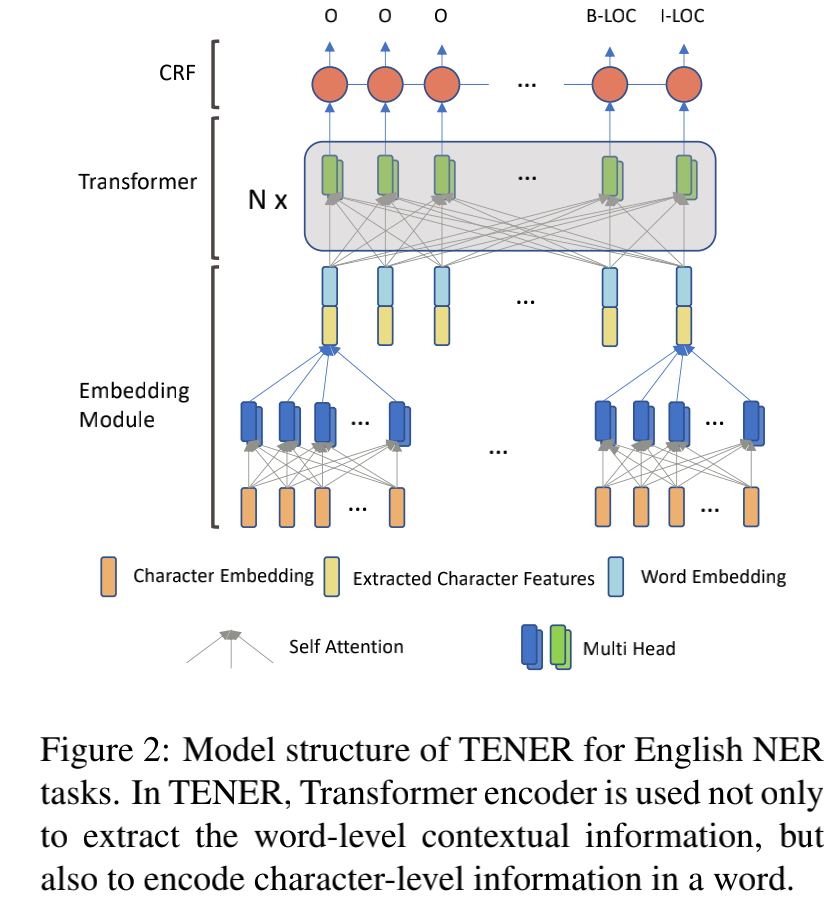
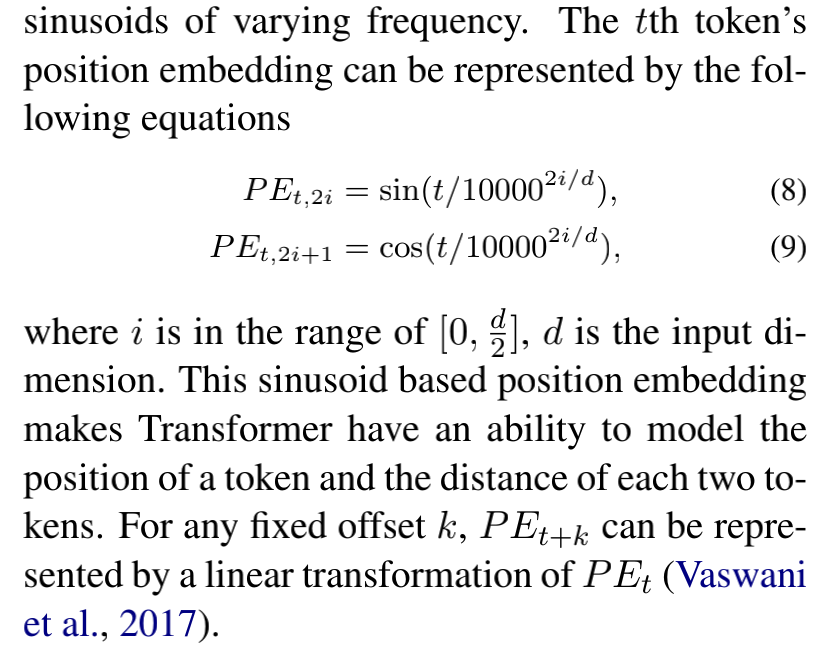
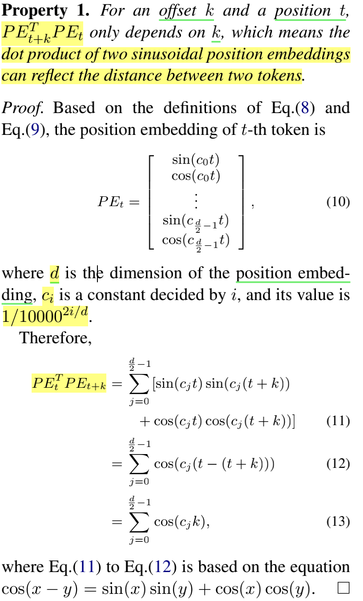
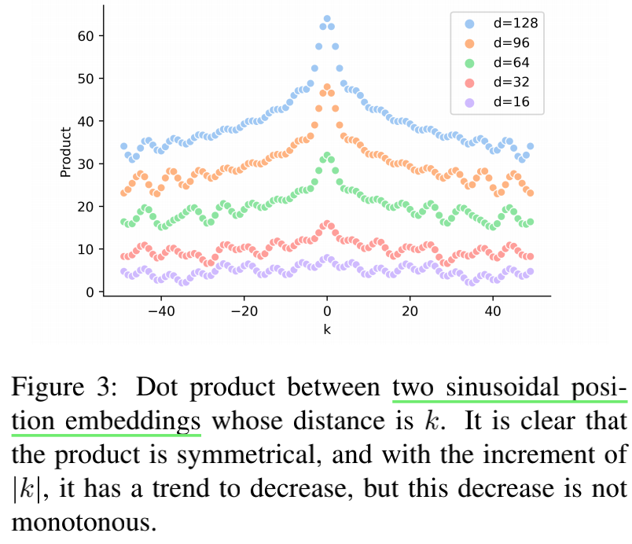
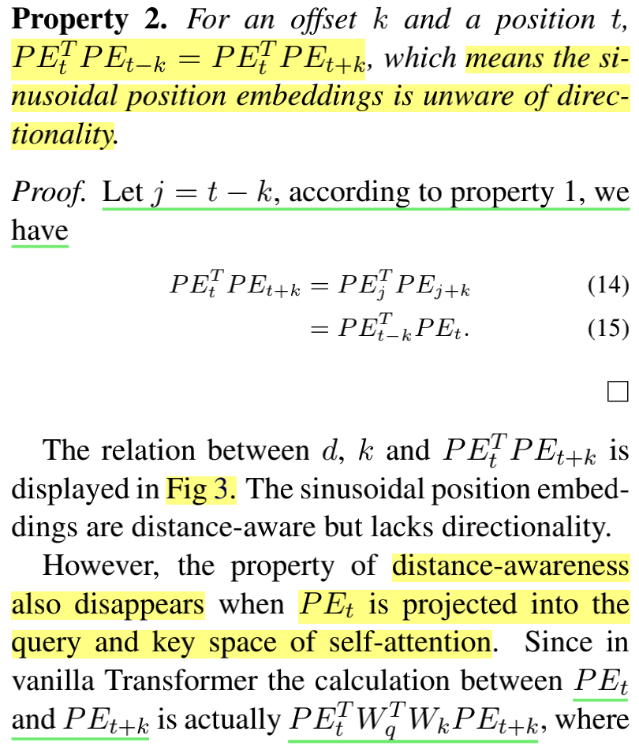
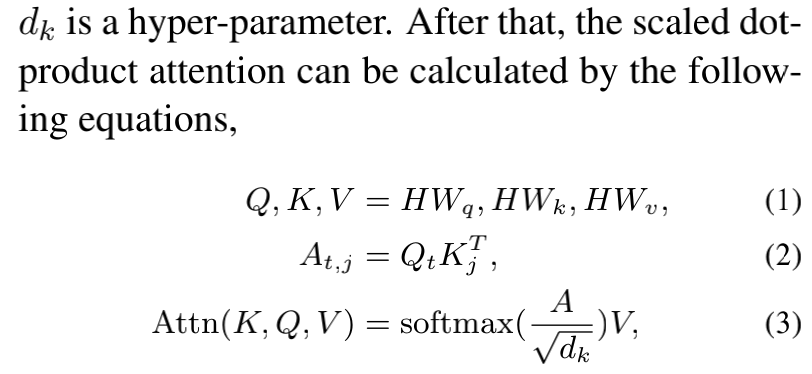
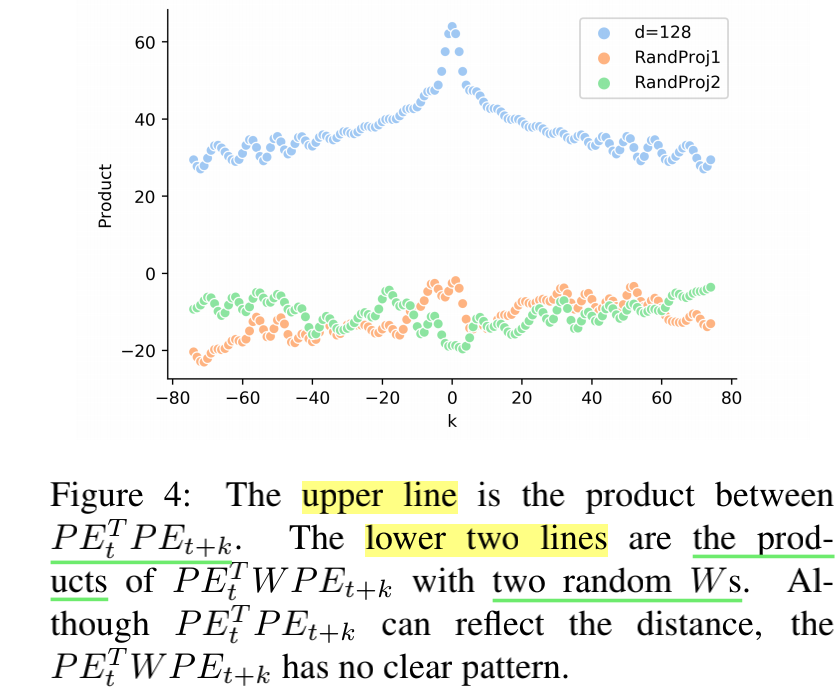
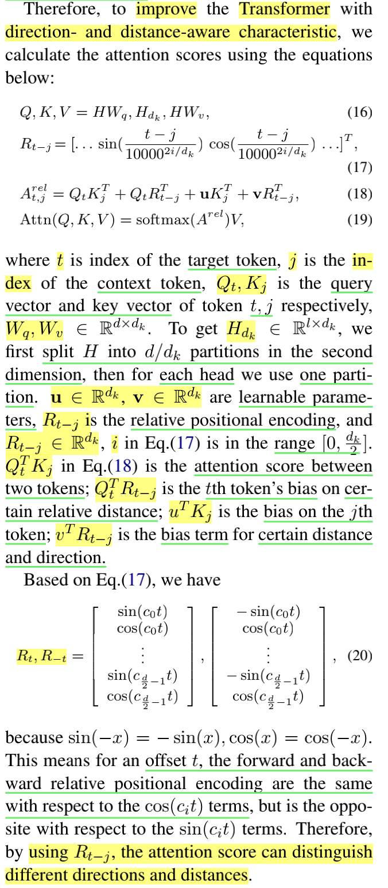
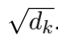
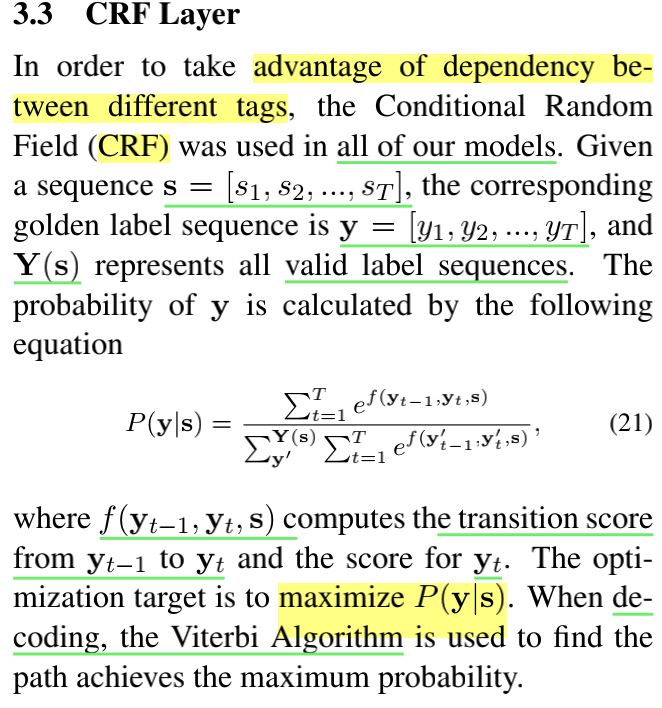

# TENER/ Adapting Transformer Encoder for Named Entity Recognition

# 一、Abstract

**1、背景：**

 				BiLSTMs广泛运用到NER任务。最近，transformer广泛应用到nlp任务（具有并行性和在建模远程上下文方面的优势），the vanilla Transformer在ner表现较差			

**2、提出**

​					TENER，自适应的Transformer Encoder 对字符级特征和单词级特征进行建模的 NER 架构

**3、做法**

​					通过结合方向感知、距离感知和未缩放的注意力（By incorporating the directiona-ware, distance-aware and un-scaled attention）

​					在6个NER数据集上实验。

​					

# 五、Conclusion

​				 TENER，自适应的Transformer Encoder，使用direction-aware,distance-aware and un-scaled attention的方式。

​					在6个NER数据集（2个en，4个zh）上实验，得到大幅度提升。

​					相同的预训练embedding 和 额外的知识，在2个en上效果优于 bilstm 和 cnn的字符encoders（transformer 能在字符中提取复杂的特征）

## 二、本文提出的模型

​		利用 Transformer 编码器为 NER 对句子的远程和复杂交互进行建模，模型框架如图2：

### 1、**3.1 Embedding Layer**

​	背景：			

​		缓解数据稀疏和词汇外 (OOV) 的问题，大多数 NER 模型采用 CNN 字符编码器 (Ma and Hovy, 2016; Ye and Ling, 2018; Chen et al., 2019) 来表示单词。 与基于 BiLSTM 的字符编码器（Lample 等人，2016 年；Ghaddar 和 Langlais，2018 年）相比，CNN 的效率更高。

​	**transformer好处**：

​			①并行

​			②**基于 Transformer 的字符编码器**的一个潜在好处是提取不同的 n-gram 甚至不连续的字符模式，例如“unhappily”和“uneasily”中的“un..ily”。

​		**最终的词嵌入是字符编码器提取的字符特征和预训练词嵌入的串联**。

### 2、**3.2 Encoding Layer with Adapted Transformer**

2个改进：

（1）**3.2.1 Direction- and Distance-Aware Attention**			

   来自 bilstm在NER成功的启发，bilstm可以有分区的从左侧 和 右侧 收集词的上下文信息，

而**transformer很难区分上下文信息来自哪一边**，虽然有**位置编码（2个正弦位置embedding的点积 the dot product between two sinusoidal position embeddings）**，但**只能反映其距离，缺少方向**。

①解释：

（反映距离）

（**2个正弦位置embedding的点积只与转移量k有关**-----两个正弦位置嵌入的点积可以**反映两个token之间的距离**），下面为证明：

（没反映方向） ：**-k和+k，其值相等，正弦位置嵌入不能辨别方向**，如图3：2个正弦位置的点乘

下面为证明：

**方向特性在哪消失？**：

​					**将 PEt 投影到 self-attention 的 query 和 key 空间**

 **scaled dot-product attention**

图4：

②改进注意力的计算：

​		

（2）**3.2.2 Un-scaled Dot-Product Attention**

​				**不缩放，在没有缩放因子，注意力会更敏锐，更敏锐的注意力可能有利于 NER 任务，因为句子中只有少数单词是命名实体**

（3）**3.3 CRF Layer**

​			为了利用不同标签之间的依赖性，我们在所有模型中都使用了CRF

